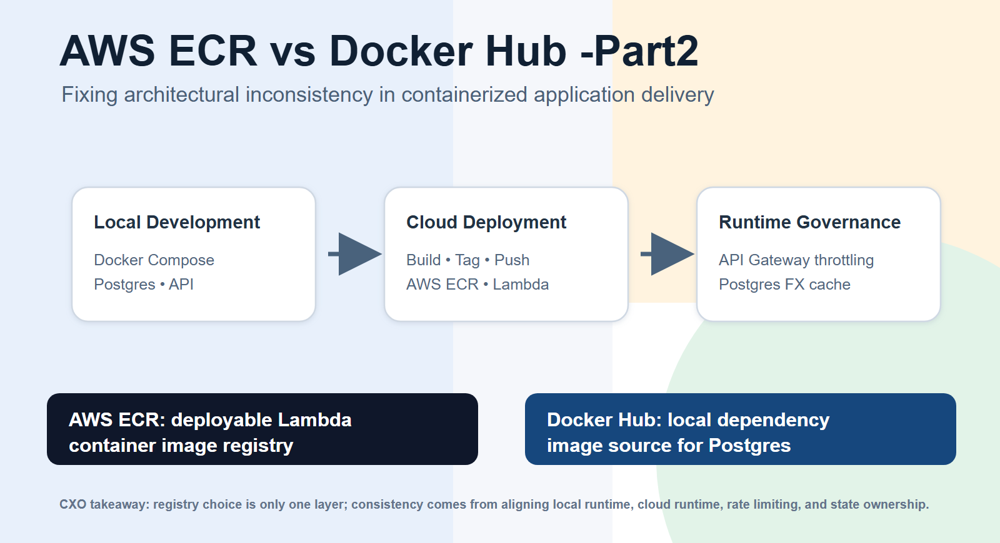
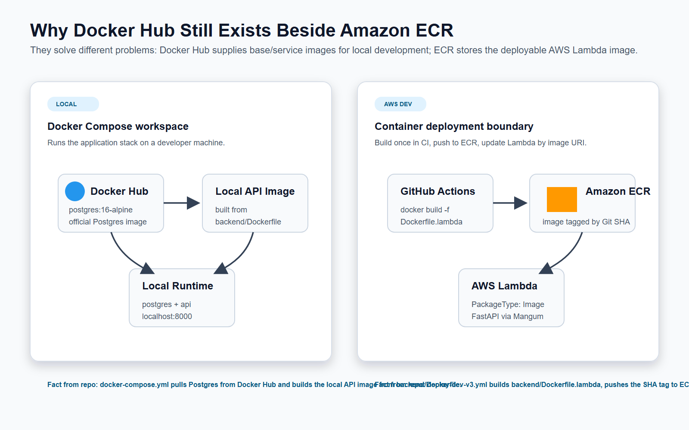
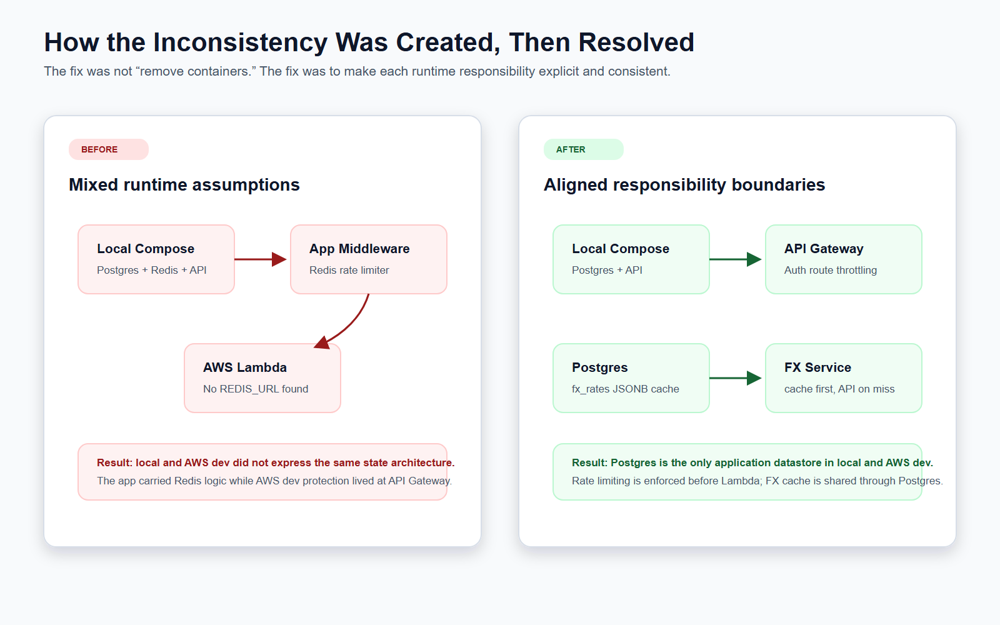

# Architectural Inconsistency in Containerized Delivery: What This Codebase Taught Us

**Header**

**Topic:** Containerization, Docker Hub, Amazon ECR, AWS Lambda, API Gateway, Postgres  
**Application context:** React/Vite frontend, FastAPI backend, PostgreSQL database, AWS Lambda container deployment  
**Core lesson:** Containerization is not just about building images. It is about keeping local development, cloud deployment, and application state responsibilities consistent.

---

In many engineering discussions, containerization gets reduced to one question:

> "Do we have a Dockerfile?"

That question is too small.

The better question is:

> "Does every container, registry, database, and runtime responsibility mean the same thing locally and in the cloud?"

This application exposed a common architectural inconsistency: local development, AWS deployment, rate limiting, and exchange-rate caching were not expressing the same operating model.

The fix was not to remove Docker. The fix was to make each boundary explicit.

---

## The Verified Containerization Model

This codebase uses two different container paths for two different purposes.



### 1. Local Development Uses Docker Compose

The local `docker-compose.yml` now runs:

- `postgres`
- `api`

The Postgres service uses:

```text
postgres:16-alpine
```

That image is an official Postgres image normally pulled from Docker Hub.

The local backend API is different. It is not pulled from Docker Hub. It is built locally from:

```text
backend/Dockerfile
```

The local backend runs FastAPI through:

```text
uvicorn app.main:app --host 0.0.0.0 --port 8000 --reload
```

So the local model is:

```text
Docker Hub Postgres image + locally built API image = local development runtime
```

### 2. AWS Dev Uses Amazon ECR

The AWS dev deployment workflow builds the Lambda backend image from:

```text
backend/Dockerfile.lambda
```

The GitHub Actions workflow:

1. Logs in to Amazon ECR.
2. Builds the Lambda container image.
3. Tags it with the GitHub commit SHA.
4. Pushes it to ECR.
5. Updates the AWS Lambda function with that exact image URI.

So the AWS model is:

```text
Git commit SHA -> Lambda container image -> Amazon ECR -> AWS Lambda
```

This separation is correct. Docker Hub and Amazon ECR are not duplicates.

They are serving different architectural roles.

---

## Why Docker Hub Exists Beside AWS ECR

Docker Hub is used for local service images.

In this application, the confirmed example is:

```text
postgres:16-alpine
```

That image gives local developers a ready Postgres database without installing Postgres directly on the host machine.

Amazon ECR is used for deployable application images.

In this application, the confirmed example is the backend Lambda container image built from:

```text
backend/Dockerfile.lambda
```

That image is pushed to ECR and used by AWS Lambda.

The distinction is simple:

| Registry | Role in this application |
|---|---|
| Docker Hub | Supplies official local dependency images, such as Postgres |
| Local Docker build | Builds the local FastAPI API image from `backend/Dockerfile` |
| Amazon ECR | Stores the AWS Lambda backend deployment image |

The problem is not having both Docker Hub and ECR.

The problem starts when the runtime assumptions around those containers drift.

---

## How the Existing Problem Was Created

The original local stack had Postgres, Redis, and the API running through Docker Compose.

At the same time, the application code contained Redis-backed rate limiting logic.

That created a local expectation:

```text
API rate limiting depends on Redis.
```

But AWS dev told a different story.

The AWS dev Lambda configuration was verified with:

```text
HasRedisUrl: false
PackageType: Image
EnvironmentName: aws_dev
State: Active
```

So AWS dev did not have a `REDIS_URL` configured.

The application middleware also failed open when Redis was unavailable, meaning requests were allowed instead of blocked.

At the same time, AWS dev API Gateway already had throttling configured:

| AWS dev route | Burst | Rate |
|---|---:|---:|
| Default route settings | `100` | `500.0/sec` |
| `POST /api/v1/auth/login` | `1` | `0.33/sec` |
| `POST /api/v1/auth/register` | `1` | `0.17/sec` |
| `POST /api/v1/auth/refresh` | `1` | `0.5/sec` |
| `POST /api/v1/auth/forgot-password` | `1` | `0.08/sec` |

That meant the actual AWS dev protection boundary was API Gateway, not Redis.

The inconsistency was:

```text
Local implied Redis-backed protection.
AWS dev used API Gateway throttling.
The app still carried Redis-based middleware assumptions.
```

A second inconsistency existed in foreign exchange rates.

The FX rate service could cache rates in Redis if a Redis client was supplied. But the application flow did not consistently pass a Redis client, and AWS dev had no Redis configuration.

So the architectural question became:

> If Postgres is the real application database, why keep Redis-shaped state logic in the application when AWS dev is already operating without Redis?

---

## How We Solved It



The solution was to make the architecture consistent across local and AWS dev.

### 1. Local Docker Compose Was Reduced to Postgres + API

Redis was removed from the local Compose stack.

The local stack now represents the real application datastore direction:

```text
Postgres + API
```

The API container uses Docker Compose service networking to connect to Postgres through:

```text
postgres:5432
```

This matters because inside a Docker container, `localhost` means the container itself. The Postgres container is a separate service, so the API container must connect to the Compose service hostname:

```text
postgres
```

### 2. Redis Was Removed From The Application Dependency Path

The Redis Python package was removed from backend dependencies.

The app-level Redis rate limiter was removed from the FastAPI middleware registration.

There is still a legacy `rate_limiter.py` file visible in the repository, but it is no longer registered in `app.main`. The active runtime path no longer depends on Redis for rate limiting.

### 3. AWS Dev Rate Limiting Was Moved To The Correct Boundary

Rate limiting is now treated as an AWS edge/API responsibility for AWS dev.

The verified AWS dev throttling layer is API Gateway HTTP API stage throttling.

That is a better boundary for public request protection because it acts before the request reaches the Lambda application runtime.

The resulting model is:

```text
Public request -> API Gateway throttling -> Lambda backend
```

Instead of:

```text
Public request -> Lambda backend -> Redis rate limiter
```

### 4. FX Rate Cache Was Moved To Postgres

A new SQLAlchemy model/table was added:

```text
fx_rates
```

The table stores:

- `id`
- `base_currency`
- `rates` as JSONB
- `source`
- `fetched_at`
- `expires_at`
- `created_at`

The FX service now uses deterministic cache selection:

```text
Use Postgres cache if a non-expired FX snapshot exists.
Call the external FX API only when there is no valid Postgres snapshot.
Store the fetched snapshot in Postgres.
Use the latest expired Postgres snapshot if the API fails.
Use hardcoded fallback rates only when API and Postgres cache are unavailable.
```

The expiration rule is based on:

```text
expires_at > current UTC time
```

The current TTL setting is:

```text
FX_RATE_CACHE_TTL_SECONDS = 86400
```

That means a stored FX snapshot is valid for 24 hours.

---

## Final Operating Model

The architecture is now easier to reason about:

| Concern | Local | AWS dev |
|---|---|---|
| Backend runtime | Docker Compose API container | AWS Lambda container image |
| Backend local image | Built from `backend/Dockerfile` | Not used |
| Backend cloud image | Not pushed | Built from `backend/Dockerfile.lambda` and pushed to ECR |
| Postgres | Docker Hub `postgres:16-alpine` image | External Postgres through `DATABASE_URL` |
| Redis | Removed from active local stack | Not configured in Lambda |
| Rate limiting | Not Redis-backed in app runtime | API Gateway throttling |
| FX cache | Previously Redis key `fx_rates:latest`; now Postgres `fx_rates` table | Postgres `fx_rates` table |

This is the key design principle:

> Local development can use containers for convenience, but it should not invent runtime dependencies that the cloud environment does not actually operate.

---

## What This Means For Engineering Leaders

This was not only a code cleanup.

It was an architecture governance correction.

The corrected design separates four concerns:

1. **Container runtime**
   Local Docker Compose and AWS Lambda both run containers, but they do not need the same Dockerfile.

2. **Container registry**
   Docker Hub supplies trusted local dependency images. ECR stores the deployable AWS image.

3. **Request protection**
   AWS dev rate limiting belongs at API Gateway before traffic reaches Lambda.

4. **Shared application state**
   Postgres is the only application datastore for both local and AWS dev. FX snapshots now live in Postgres, not Redis.

The outcome is a simpler architecture with fewer hidden assumptions:

```text
Docker Hub: local dependency images
Local Docker build: local API runtime
Amazon ECR: Lambda deployment image
API Gateway: request throttling
Postgres: application data and FX snapshots
```

---

## Codebase Evidence

This article is based on verified codebase and AWS dev facts:

- `docker-compose.yml` now defines `postgres` and `api`, with no Redis service.
- `docker-compose.yml` builds the local API from `backend/Dockerfile`.
- `docker-compose.yml` uses `postgres:16-alpine` for local Postgres.
- `.github/workflows/deploy-dev-v3.yml` builds `backend/Dockerfile.lambda`.
- `.github/workflows/deploy-dev-v3.yml` pushes the SHA-tagged Lambda image to Amazon ECR.
- `.github/workflows/deploy-dev-v3.yml` updates the AWS Lambda function with that image URI.
- AWS dev Lambda was verified as `PackageType: Image`.
- AWS dev Lambda was verified with no `REDIS_URL`.
- AWS dev API Gateway stage throttling was verified for default and auth routes.
- `app.main` no longer registers `RateLimitMiddleware`.
- `fx_rate_service.py` now uses the `fx_rates` Postgres table as the shared cache source.
- `models.py` defines `FXRate`.
- Alembic migration `c9f1a2d4e7b8_add_fx_rates_table.py` creates the `fx_rates` table.

One remaining documentation cleanup is visible: older runbook/agent notes still mention Redis. Those docs should be updated so operational documentation matches the active architecture.

---

## Footer

**Architecture takeaway:**  
Containerization succeeds when image boundaries, registry boundaries, runtime dependencies, and state ownership are all explicit.

**Final principle:**  
Do not keep a local dependency just because it once made development convenient. Keep it only if the cloud runtime actually needs it, or if the architecture intentionally documents why local and cloud differ.

For this application, the resolved model is:

```text
Postgres for application state.
API Gateway for AWS dev rate limiting.
Docker Hub for local dependency images.
Amazon ECR for deployable Lambda images.
```

#Containerization #AWS #Docker #AmazonECR #DockerHub #PostgreSQL #FastAPI #APIGateway #CloudArchitecture #SoftwareArchitecture #DevOps #EngineeringLeadership
